# Individual Assignment — Mobile & IoT Development

**Name:** Akshara Madarapu
**Partner:** Maya Zhang (GitHub: `mayazhang1241`)

> **TODO before submitting:** the two reflection sections in §5 — "What I learned about
> working with others" and "What I'd do differently" — are prompts, not finished answers.
> Rewrite them in your own words, and edit anything else that doesn't sound like you.
**Repository:** https://github.com/akshara-rm34/whichcard
**Live backend API:** https://whichcard-api.vercel.app — health check: https://whichcard-api.vercel.app/api/health

---

## 1. What I built

**WhichCard** — an iOS app that tells you which credit card in your wallet to pull out,
based on where you're physically standing.

Press one button and the app:

1. reads your **GPS location** (`expo-location`)
2. queries the **Overpass API** (OpenStreetMap) for merchants within 400m
3. maps each merchant's OSM tag (`amenity=cafe`, `shop=supermarket`, …) to a spend
   category
4. scores that category against the cards you carry, using a table of real earning rates
5. tells you the best card, the multiplier, and why — *"4x — American Express Gold Card,
   4x at restaurants worldwide, up to $50k/yr"*

Backing it is a **REST API I deployed on Vercel with a Neon Postgres database**, which
handles:

- **accounts and authentication** — so your wallet is private to you
- **wallet storage** — which cards you carry, following you across devices
- **crowdsourced category corrections** — when the app guesses a merchant's category
  wrong, any user can correct it, and every other user sees that correction
- **usage analytics** — every search, lookup, and correction is recorded

The app also fires a **local notification** when something nearby earns 3x or better.

### Why I chose this

I wanted something that would (a) force me through the whole stack rather than just one
layer, and (b) be worth keeping afterward. I had a hand-curated dataset of 16 credit
cards and their category earning rates from a previous project, so the domain logic
already had real data behind it and I could spend my time on the parts I actually wanted
to learn — mobile development, deploying a backend, and working in a shared repo.

The crowdsourced corrections feature isn't decoration. It exists because the problem is
real: OpenStreetMap tagging is inconsistent, and no static mapping table can fix it.
Target is `shop=department_store` and maps to no bonus category at all. A warehouse
club's fuel pump is `amenity=fuel` sitting inside `shop=wholesale`. When the app guesses
wrong it costs the user points, so letting users fix it — and sharing that fix — is the
honest solution. That single feature is also what justifies having real user accounts,
since you need identity to attribute and limit votes.

### What I hoped to learn

- How a React Native app actually runs on a physical phone, not a simulator
- How to design and deploy a REST API with authentication that isn't toy-grade
- How to work in a shared repository with someone else without stepping on each other

### The app

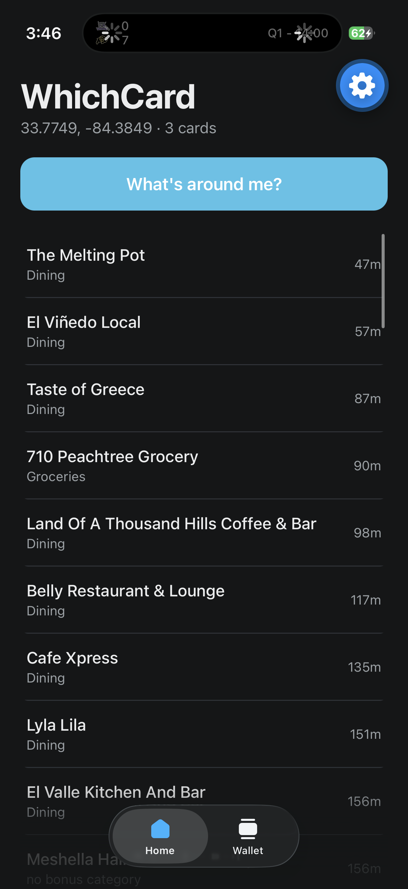

*Nearby merchants pulled live from OpenStreetMap, sorted by distance, each already
resolved to a spend category. Taken in midtown Atlanta at 33.7749, -84.3849.*

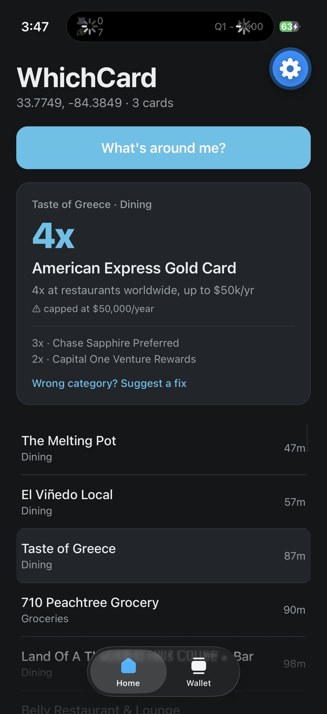

*Tapping a merchant scores it against my wallet. Taste of Greece resolves to Dining, so
the Amex Gold's 4x wins — and the app shows the issuer's own wording as the reason, plus
the $50k/year cap, plus the runners-up so you can see what you'd give up.*

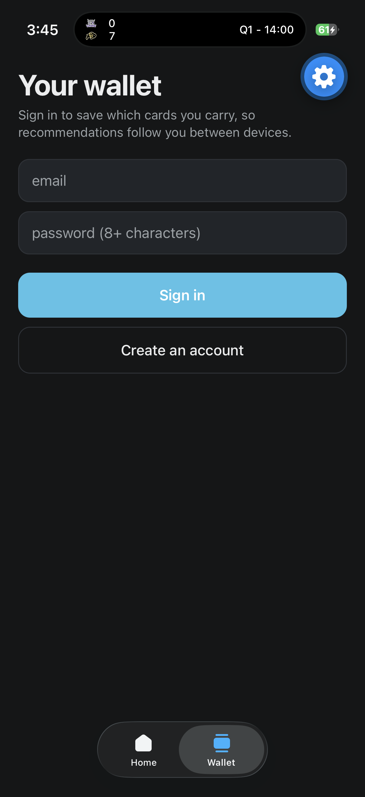
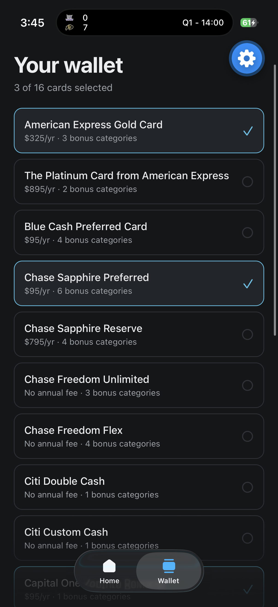

*The Wallet tab. Signed out it's a sign-in form; signed in it's a picker over all 16
cards, and the selection is stored server-side rather than on the device.*

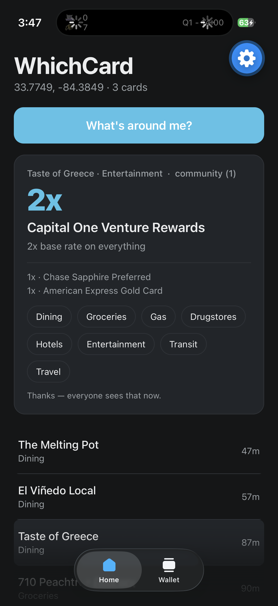

*Submitting a category correction. I reclassified Taste of Greece as Entertainment, and
the recommendation immediately changed — the header now reads `community (1)`, the
community's answer having overridden the OSM tag, and the best card dropped from 4x Amex
Gold to 2x Capital One Venture. Anyone else opening the app sees that same correction.*

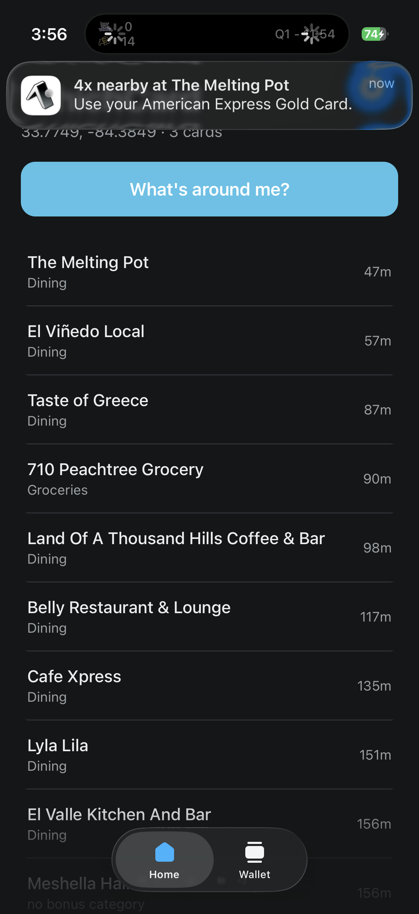

*A local notification fired when a nearby merchant beat the 3x threshold.*

---

## 2. Assignment requirements

| # | Requirement | How it's met |
|---|---|---|
| 1 | Install a development environment | Expo SDK 57 / React Native, Node 26, on macOS |
| 2 | Build a sample app, run it on a **device** | Stock `expo-router` template built and run on my iPhone via Expo Go, then evolved into WhichCard. Commit `a4747ef` is the unmodified template |
| 3 | Check code into version control, track tasks | https://github.com/akshara-rm34/whichcard — 6 commits, 10 GitHub issues used for tasks and bugs |
| 4 | Partner checks out, changes, tests, pushes back | See §5 |
| 5 | Deploy a web service with storage + REST | https://whichcard-api.vercel.app — Vercel serverless functions + Neon Postgres, 9 endpoints |

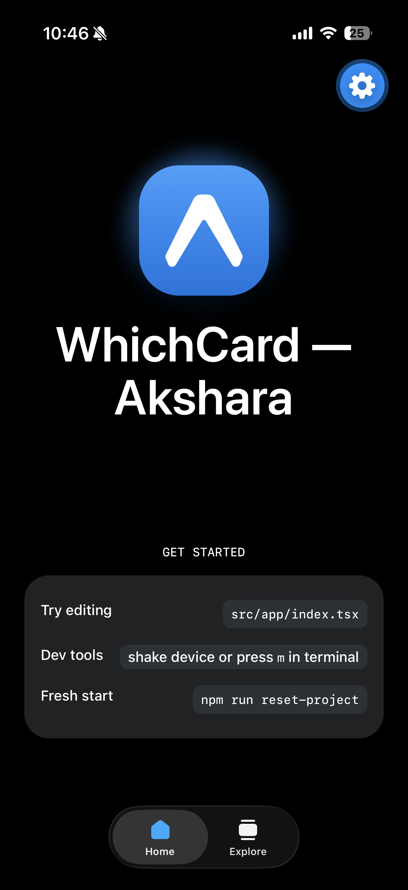

*The starting point: the stock `expo-router` sample template running on my physical
iPhone, with its original Home/Explore tabs and "GET STARTED" hints. The heading is the
one line I changed to confirm Fast Refresh was pushing edits to the device — the app
updated without a reload. Commit `a4747ef` is this template unmodified; everything after
it is mine.*

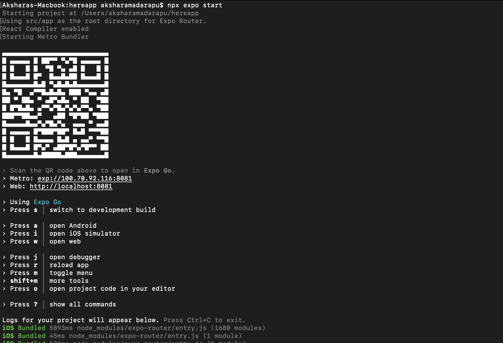

*The Metro dev server. The phone connects over the LAN at `exp://100.70.92.116:8081`;
the `iOS Bundled` lines at the bottom are my device pulling bundles.*

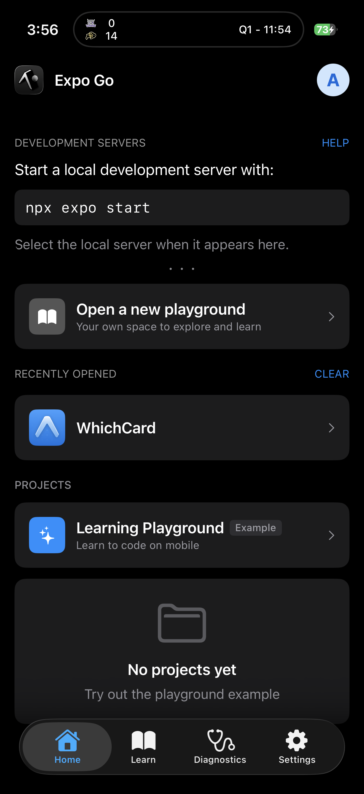

*WhichCard loaded in Expo Go on my iPhone — a physical device, not a simulator.*

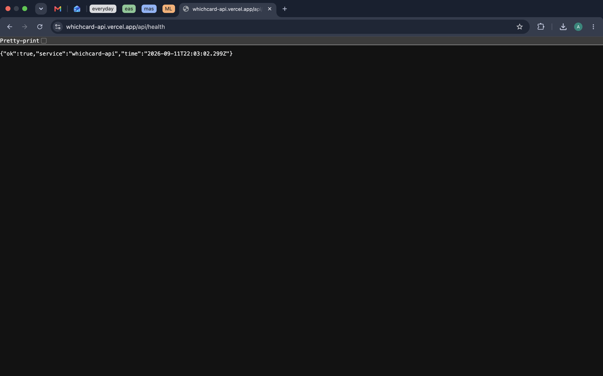

*The deployed API answering.*

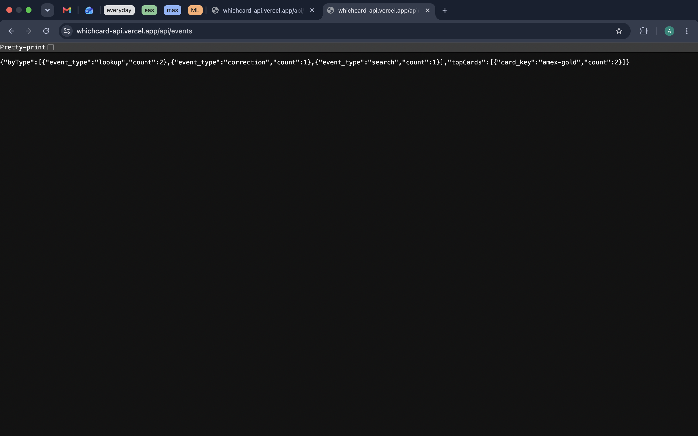

*`GET /api/events` showing real usage collected from my phone: 1 search, 2 lookups, 1
correction, with `amex-gold` the most-recommended card. Aggregates only — the endpoint
deliberately never returns individual rows.*

**Exceptional items attempted:**

| Item | How |
|---|---|
| Authentication | scrypt-hashed passwords with per-user salts, opaque revocable session tokens, wallet endpoints scoped to the signed-in user |
| Third-party service | Overpass API / OpenStreetMap for merchant data |
| Device sensor / native feature | GPS via `expo-location` |
| User content shown to other users | Crowdsourced merchant category corrections |
| Notifications | Local notification when a nearby merchant earns ≥3x |
| Usage data collection | `/api/events` records every search, lookup, and correction |

---

## What I understand about the platform now

**Expo Go is a host app, not my app.** It's a prebuilt binary that downloads and runs my
JavaScript, which is why it starts instantly and why I never touched Xcode. The tradeoff
is that it only contains the native modules Expo shipped inside it. This isn't academic:
it's exactly why WhichCard uses *local* notifications rather than push. Expo Go on iOS
cannot receive remote push notifications — that requires a development build with its own
APNs credentials. Knowing the distinction is what let me pick a design that works instead
of fighting one that can't.

**Metro serves bundles over HTTP and pushes updates over a websocket, and those fail
independently.** When Fast Refresh stopped working, the dev server was still returning
`200` on `/status` and still serving bundles — it was only the HMR websocket that had
died after ~14 hours. A process answering requests is not the same as a process working.
That's why the fix was restarting the server rather than debugging my code.

**`CI=1` is not a neutral "don't prompt me" flag.** It puts Metro in CI mode, which
disables watch mode entirely. I learned to check what a non-interactive flag turns off,
not just what it suppresses.

**Expo Router is file-based.** `src/app/index.tsx` is `/`, `src/app/wallet.tsx` is
`/wallet`. Adding the Wallet tab meant creating a file and updating the tab trigger —
and because the project has typed routes enabled, TypeScript caught my stale
`/explore` reference at compile time instead of at runtime.

**Foreground vs. background location is a real design decision.** I used foreground-only
permissions deliberately: background location means a much heavier permission prompt and
more review scrutiny, for no benefit in an app the user opens when they're standing
somewhere.

**Serverless functions have no persistent connection pool.** That's why the backend uses
`@neondatabase/serverless`, which speaks HTTP rather than raw TCP — a conventional
Postgres driver would try to hold connections across invocations that don't persist, and
exhaust the database's connection limit under cold starts.

**Password hashing should be slow on purpose.** I used scrypt with a per-user random
salt rather than SHA-256. A fast hash makes an offline attack on a leaked password table
cheap, which is the precise thing password hashing exists to prevent. Relatedly, login
returns an identical response for an unknown email and a wrong password, because an
endpoint that distinguishes them tells an attacker which addresses are worth attacking.

**Opaque tokens vs. JWTs is a revocation tradeoff.** A JWT stays valid until it expires
regardless of what the server thinks, so signing out can only ask the client to forget
it. I used opaque random tokens stored in a `sessions` table, so logging out can actually
delete the session.

**OpenStreetMap models merchants as nodes, ways, and relations.** A node-only Overpass
query silently misses any merchant mapped as a building outline — which is many of them.
`nwr(...)` with `out center` covers all three and gives ways a representative coordinate.

**Some bugs only exist on a real device.** Three of mine did: the sign-out button that
collided with Expo Go's floating dev button, the Overpass mirror that hung only when
requested from the phone's network, and the notification permission flow. None would
have appeared in a simulator screenshot, and none were visible by reading the code.

---

## Technologies used

| Layer | Technology |
|---|---|
| Mobile framework | React Native 0.86 via **Expo SDK 57** |
| Language | **TypeScript** (strict mode), app and backend |
| Routing | **Expo Router** (file-based) |
| Device APIs | `expo-location` (GPS), `expo-notifications` (local notifications), `@react-native-async-storage/async-storage` (token storage) |
| Run target | **Expo Go** on a physical iPhone |
| Third-party data | **Overpass API** / OpenStreetMap (free, keyless) |
| Backend runtime | **Vercel Functions** (Node, serverless) |
| Database | **Neon Postgres** (serverless, free tier) |
| DB driver | `@neondatabase/serverless` (HTTP, not TCP — no pool to exhaust on cold start) |
| Auth | **scrypt** password hashing (Node `crypto`) + opaque session tokens |
| Version control | **Git** / GitHub, issues and labels for task and bug tracking |
| Tooling | Vercel CLI, GitHub CLI (`gh`), Metro bundler |
| AI assistance | **Claude Code** — see the disclosure below |

---

## 3. References

Listed roughly in the order I used them.

### Environment and platform

- **Expo documentation** — https://docs.expo.dev/
  Used to set up the project and understand the Expo Go workflow. The key thing I
  learned is the difference between **Expo Go** (a prebuilt host app that runs your
  JavaScript — fast, but limited to the native modules it already contains) and a
  **development build** (your own native binary). This distinction later explained why
  remote push notifications aren't available to me.
- **`expo-location`** — https://docs.expo.dev/versions/latest/sdk/location/
  Foreground permission flow and `getCurrentPositionAsync`. I deliberately used
  foreground-only permissions; background location would have meant a much heavier
  permission prompt for no benefit here.
- **`expo-notifications`** — https://docs.expo.dev/versions/latest/sdk/notifications/
  Local notification scheduling. Documented here that Expo Go on iOS cannot receive
  remote push as of SDK 53 — which is why I used local notifications instead.
- **Expo Router** — https://docs.expo.dev/router/introduction/
  File-based routing; screens are files in `src/app/`. This is how the Wallet tab was
  added (`src/app/wallet.tsx`).

### Data sources

- **Overpass API** — https://overpass-api.de/ and https://wiki.openstreetmap.org/wiki/Overpass_API
  Free, keyless queries against OpenStreetMap. I learned Overpass QL well enough to
  write a radius query across nodes, ways and relations (`nwr`) with `out center`, which
  matters because many real merchants are mapped as building outlines rather than points
  — a node-only query silently misses them.
- **OpenStreetMap tag reference** — https://wiki.openstreetmap.org/wiki/Map_features
  Used to build the tag-to-category table in `src/lib/categories.ts`. This is where I
  learned how inconsistent real-world tagging is, which reshaped the app's design.
- **`data/cards.json`** — hand-curated by me from public issuer information for a prior
  project. Field names mirror the Rewards Credit Card API schema so it could be swapped
  for a live feed later.

### Backend

- **Vercel Functions** — https://vercel.com/docs/functions
  Serverless endpoints as files under `api/`. Deployed with the Vercel CLI.
- **Neon Postgres** — https://neon.tech/docs
  Free-tier Postgres, provisioned through the Vercel marketplace integration.
- **`@neondatabase/serverless`** — https://github.com/neondatabase/serverless
  The driver speaks HTTP rather than raw TCP, which is what makes it usable from
  serverless functions — there's no connection pool to exhaust across cold starts.
- **Node `crypto` scrypt** — https://nodejs.org/api/crypto.html#cryptoscryptpassword-salt-keylen-options-callback
  Password hashing. I learned *why* a deliberately slow hash matters: a fast hash like
  SHA-256 makes an offline attack on a leaked password table cheap, which is the exact
  thing password hashing exists to prevent.

### AI assistance — disclosure

I used **Claude Code** (Anthropic's CLI coding agent) as a virtual teammate throughout
this assignment. Being specific about the division of labour, since the assignment asks
for it:

**What I directed.** I chose the project and its scope, decided to reuse my existing
card dataset, and chose the feature set. When offered a simpler "geo note board" idea, I
rejected it in favour of something that would look better on a resume and could carry
into a team project. I set the hard constraint that **nothing could cost money**, which
ruled out the Google Places API and shaped the choice of Overpass and free tiers
throughout. I decided the order of work (core loop before backend), asked for commits to
be authored solely by me, and did all the on-device testing — every bug below was found
by me running the app on my phone and reporting what I saw. I also set up the Github repo
and deployed the backend. Lastly, I made drafts of issues that the AI could polish and add
to the Github.

**What the AI did.** Wrote the majority of the code, diagnosed failures from the
symptoms I described, and set up the GitHub issues based on my context.

**What I learned from the experience.** The most useful thing was watching how it
debugged rather than what it wrote. When "Could not reach Overpass" appeared on my
phone, it didn't guess — it timed both endpoints directly from the terminal, which
immediately showed that the main endpoint was healthy at 1.2s while the mirror hung for
45 seconds with zero bytes. That reframed the problem completely: the bug wasn't the
network, it was that my fallback was worse than having no fallback. I've since started
reaching for "measure it directly" earlier instead of reading code looking for the
mistake.

I also learned to be suspicious of confident-sounding fixes. At one point it "fixed" a
Fast Refresh problem by restarting the dev server with `CI=1` to suppress a prompt —
which silently disabled Metro's watch mode and reintroduced the same symptom by a
different route. I caught it from Metro's output, but it's a good reminder
that a fix that looks right and a fix that works aren't the same thing, and that you
verify by observing behaviour rather than by reasoning about the change.

---

## 4. How to download and run it

### The app

Requires Node 20+ and a phone with [Expo Go](https://expo.dev/go).

```bash
git clone https://github.com/akshara-rm34/whichcard.git
cd whichcard
npm install
npx expo start
```

Scan the QR code with your iPhone camera, or the Expo Go app on Android.

If it never connects, your wifi probably has client isolation on (common on campus
networks — check whether your IP is in the `100.64.0.0/10` range). Use
`npx expo start --tunnel` instead.

### The backend

Already deployed at https://whichcard-api.vercel.app. To run your own copy:

```bash
cd server
npm install
vercel link
vercel env pull .env.local     # gets DATABASE_URL from the Neon integration
node scripts/migrate.mjs       # creates the tables
vercel deploy --prod
```

Full endpoint documentation is in [`server/README.md`](server/README.md).

### Try the API directly

```bash
API=https://whichcard-api.vercel.app

curl $API/api/health

curl -X POST $API/api/auth/signup \
  -H 'Content-Type: application/json' \
  -d '{"email":"you@example.com","password":"at-least-8-chars"}'
```

---

## 5. Version control history and working with a partner

### Commit history

| Commit | What |
|---|---|
| `a4747ef` | Initial commit — the unmodified Expo sample template (55 files) |
| `a49929e` | Rebranded to WhichCard, added README and DEVLOG |
| `83e2868` | Core loop: GPS → Overpass → category → card recommendation |
| `77dfe62` | Backend REST API: auth, wallet, corrections, analytics (518 lines) |
| `4eef44d` | Deployed to Vercel with Neon Postgres, added migration script |
| `d112c7d` | Wired the app to the backend, corrections UI, local notifications |
| `5a06582` | Fixed sign-out button hidden behind Expo Go's dev button |

Issues were used for tasks and bugs, not just as a checklist — issue #8 is a bug I hit,
diagnosed, fixed, and closed with the explanation attached.

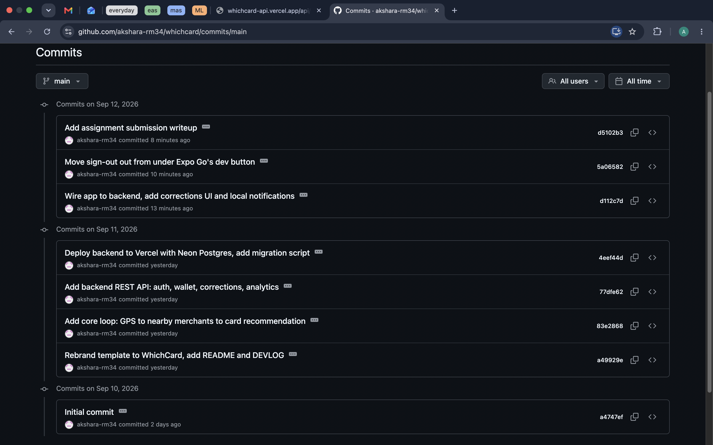

*Eight commits across three days, each with a message explaining the reasoning rather
than just the change.*

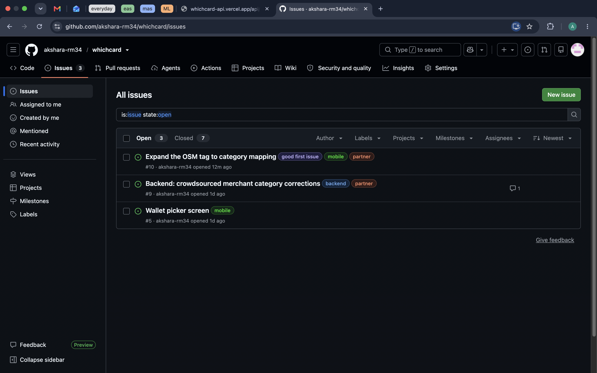

*Issues used to track the work: 7 closed, 3 open. Two are labelled `partner` and
reserved for Maya.*

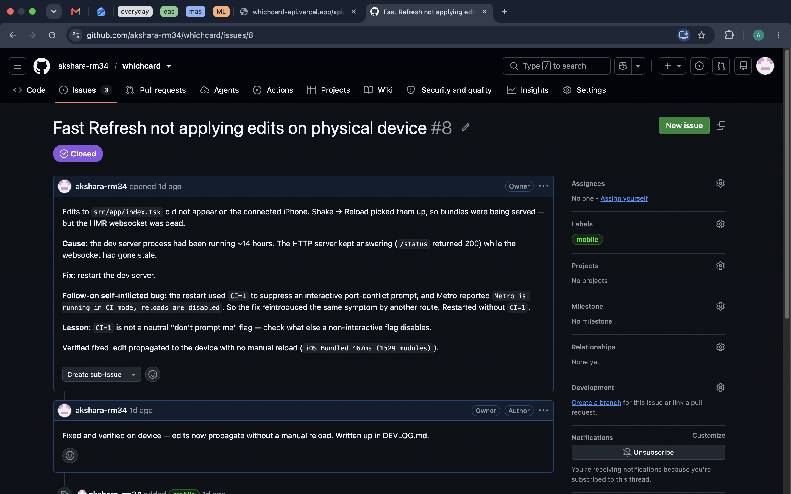

*Issue #8 — a bug I hit, diagnosed, fixed, and closed with the explanation attached,
including the follow-on bug I caused while fixing it.*

### Coordination with Maya

We split the work by area: I took the app and the backend, Maya took issue #10,
expanding the OpenStreetMap tag-to-category mapping. I asked her to open a pull request
rather than push to `main`, so the review would be visible in the history.

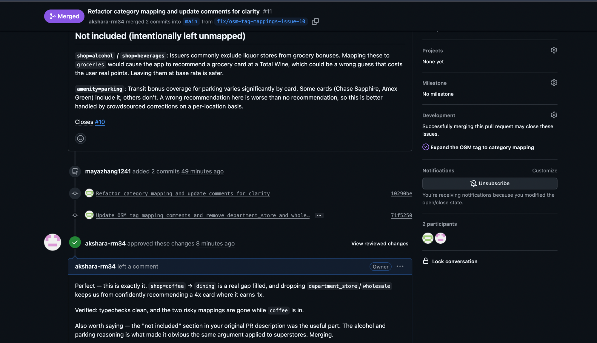

*Pull request #11. Maya's two commits, my approval, and the merge. Her PR description
documented not just what she mapped but what she **deliberately left unmapped**, and why
— that section turned out to matter.*

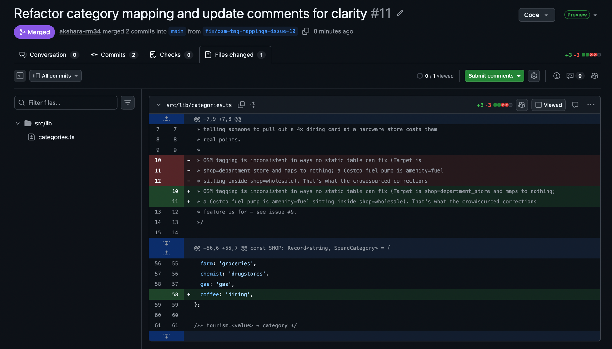

*The final diff: `shop=coffee` → `dining` added, and the file header comment restored.*

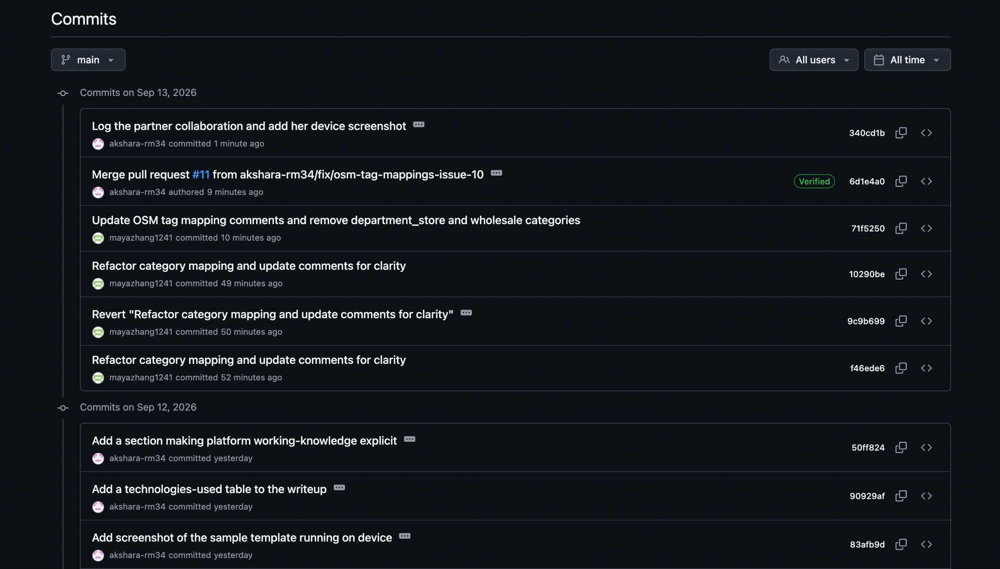

*`main` after the merge — Maya's commits alongside mine, including the revert described
below.*

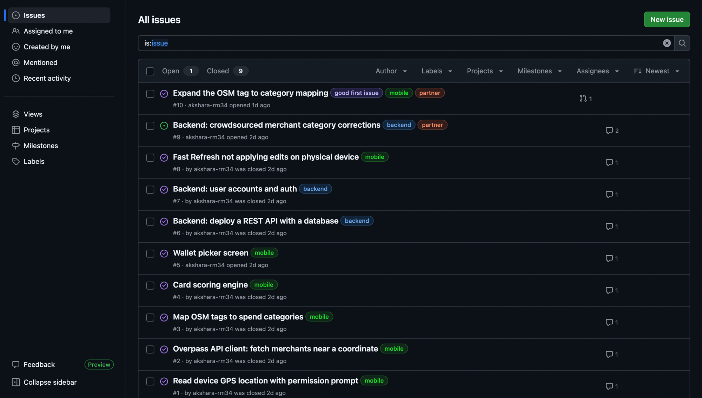

*Issue tracking across the project: 9 closed, 1 open. #10 was closed automatically by
her PR.*

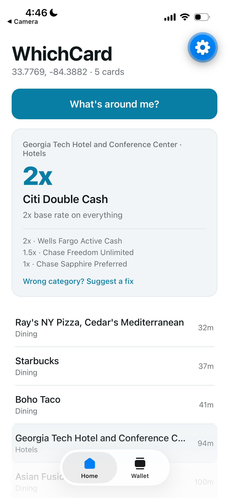

*Maya running the app on her own iPhone: her location, her own account with a 5-card
wallet, light mode. Evidence she built and used it rather than only editing a file.*

**Two things happened worth recording.**

First, her initial change went **straight to `main`** (`f46ede6`). She then **reverted it
herself** (`9c9b699`) and reopened the same work as a pull request — nobody asked her to.

Second, the review caught a real bug. Her first version mapped
`shop=department_store` → `groceries` (Target) and `shop=wholesale` → `groceries`
(Costco). Checking that against our own card data showed the problem:

```
capital-one-savor          3x | 3% at grocery stores (excl. superstores)
amex-gold                  4x | 4x at US supermarkets
bofa-customized-cash       2x | 2% at grocery stores and wholesale clubs
```

Issuers draw a hard line between supermarkets and superstores or warehouse clubs. The app
would have said *"use your Amex Gold, 4x"* at a Costco, where it earns 1x — exactly the
failure the file's header comment warns about.

The interesting part is that **her own reasoning already contained the answer.** She had
deliberately left `shop=alcohol` unmapped because "issuers commonly exclude liquor stores
from grocery bonuses" — the same argument, applying more strongly to superstores, where
one card spells the exclusion out in data we already had. She updated the PR to drop both
mappings and keep `shop=coffee`.

We coordinated over iMessage throughout — quick and low-friction, with GitHub carrying
anything that needed to be precise (the issue description, the PR, the review).

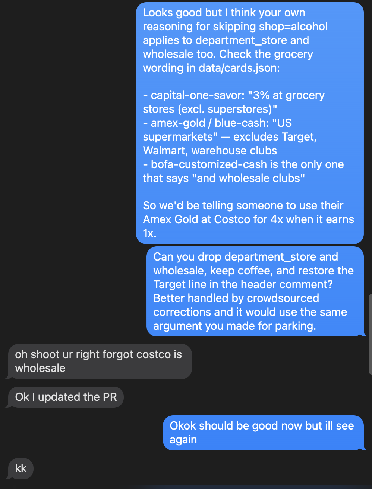

*The review, relayed over text with the card data quoted so the reasoning was checkable
rather than just asserted. Maya's reply — "oh shoot ur right forgot costco is wholesale"
— and she updated the PR straight away.*

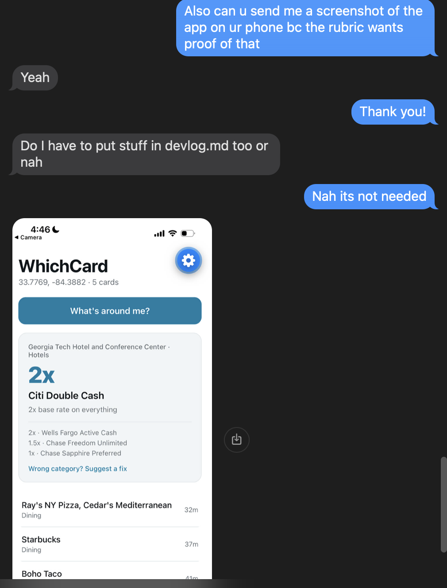

*Asking for proof she'd run it on her own device, and answering whether she needed to
write in my `DEVLOG.md` (she didn't — it's my log for my writeup; she keeps her own for
hers, since we submit separately).*

### My change to Maya's repository

The requirement runs both ways, so I also worked on her project —
[study-space-tracker](https://github.com/mayazhang1241/study-space-tracker), a React
Native app for finding open study spots on campus, backed by Firebase. She left me
issue #1: the list view showed each spot's occupancy but never said how fresh that
number was.

**PR:** https://github.com/mayazhang1241/study-space-tracker/pull/2

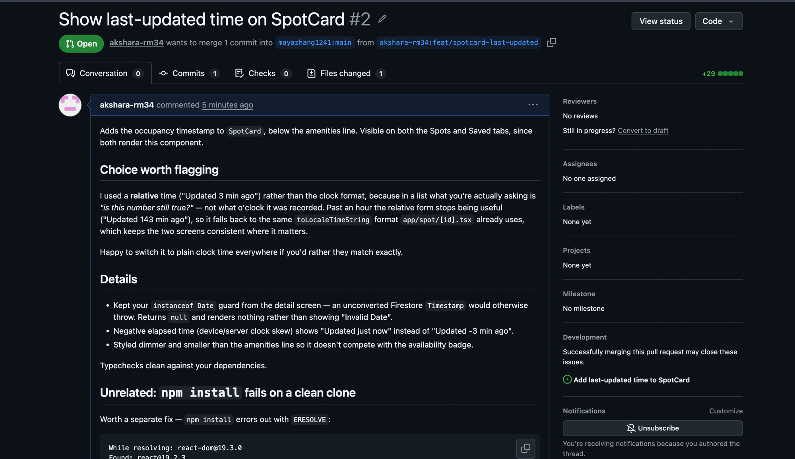

I made a deliberate choice worth defending: a **relative** time ("Updated 3 min ago")
rather than the clock format her detail screen uses. Scanning a list, the question you're
actually asking is *"is this number still true?"*, not what o'clock it was recorded.
Past an hour the relative form stops being informative, so it falls back to her existing
`toLocaleTimeString` format — consistent where consistency helps, different where the
context differs. I said so in the PR and offered to match her format exactly if she
preferred.

I also kept the `instanceof Date` guard she used on the detail screen, since an
unconverted Firestore `Timestamp` would throw without it.

**Two things I hit working in someone else's repo:**

- **No push access.** I'd added her as a collaborator on mine, but that isn't reciprocal —
  my push was rejected with `403`. I forked and opened the PR from the fork, which is
  how outside contributions normally work anyway.
- **`npm install` fails on a clean clone of her repo.** It dies with `ERESOLVE`:
  `react-dom@19.3.0` requires `react@^19.3.0` and the project pins `react@19.2.3`.
  Anyone cloning it hits this. I used `--legacy-peer-deps` to get moving and flagged it
  in the PR with the fix (`npx expo install --check`).

That second one is the part I'd have missed by only working in my own repo: the project
ran fine for her, because her `node_modules` predated the mismatch. It only breaks for a
new person — which is exactly who a collaborator is.

### What I learned about working with others

> **[TODO — REWRITE IN YOUR OWN WORDS.]** The bullets below are prompts from things that
> actually happened, not your answer. Keep what rings true, cut what doesn't, say it how
> you'd say it.

- I reserved issue #9 for Maya and then built it myself while doing the rest of the
  backend, because the corrections endpoints shared plumbing with auth and wallet. I had
  to re-scope and hand her a different task (#10). The lesson: reserving work for
  someone isn't the same as protecting it, and the person moving fastest can quietly
  erase the other person's task without meaning to.

### What I'd do differently

> **[TODO — REWRITE IN YOUR OWN WORDS.]** Same as above — prompts, not an answer.

- Get the partner side started on day one. I left it late, and it's the one requirement
  I can't complete alone or at the last minute.
- Ask for my partner's repo URL at the same time as sending mine, since the requirement
  runs in both directions.

---

## 6. Problems I hit and what I learned

Full detail with error messages is in [`DEVLOG.md`](DEVLOG.md). Summary:

| # | Problem | Resolution | Lesson |
|---|---|---|---|
| 1 | Laptop on a CGNAT address (`100.70.x.x`) — networks like that often block phone→laptop connections | Worked anyway; `--tunnel` identified as the fallback | Recognising the address range told me *in advance* what would break and why |
| 2 | Fast Refresh stopped applying edits | Dev server had run ~14h; the HTTP server still answered while the HMR websocket had died | A process that responds isn't necessarily a process that works |
| 3 | The fix reintroduced the bug — `CI=1` silently disables Metro's watch mode | Restarted without it | A flag added to suppress a prompt may turn off more than the prompt |
| 4 | Overpass returned a 504 as an **XML page**, crashing the JSON parser | Defensive parsing, retry, mirror fallback | A free volunteer-run API is a real dependency with real failure modes |
| 5 | 250m radius returned only 3 merchants | Widened to 400m | OSM coverage varies enormously; the code can't fix the data |
| 6 | Neon provisioning blocked on terms acceptance | Accepted them myself | Some steps are blocked on consent, not tooling — correctly |
| 7 | Migration script: `ERR_MODULE_NOT_FOUND` | Node resolves packages from the *script's* location, not the working directory | Moved it into the repo, where it belonged |
| 8 | **"Could not reach Overpass" on the phone after a 40s wait** | The mirror accepted connections and never responded; a transient primary failure fell through to a fallback that hung, then reported the *mirror's* error | Redundancy is only redundancy if the backup fails fast. Also: RN doesn't reliably set `err.name === 'AbortError'`, so every timeout was mislabelled as a connection failure |
| 9 | Sign-out button untappable | It sat under Expo Go's floating dev button | The layout wasn't wrong — it collided with the *host* app. Only a real device shows this |

The one I'd highlight is **#8**, because it's the clearest example of a bug that no
amount of reading the code would have found. It only appeared on the physical device,
the error message actively pointed in the wrong direction, and the fix was to make the
system *fail faster* rather than to make it more robust.
